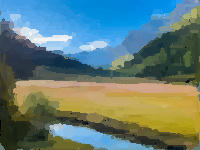

# Image processing in Rust

## Impressionist
Impressionist uses a simple stochastic hill climbing algorithm to create abstract art from photographs that (sometimes) looks like the work of an impressionist painter

**Here is a demo picture from my code**

### Inspired by the Book "Computer Science From Scratch" by David Kopec
https://davekopec.com/

You can find out more about the book here: https://computersciencefromscratch.com/